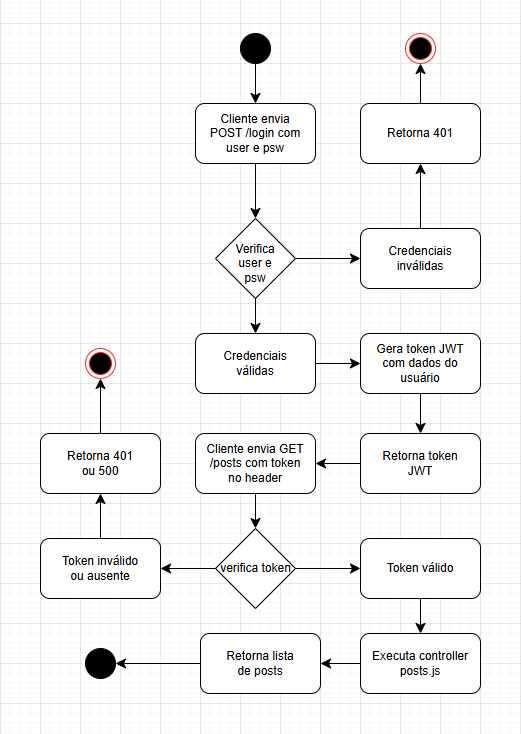

# Projeto Tela Principal com Posts

Este projeto é uma aplicação simples que contém uma tela de login e uma tela principal que exibe posts. A aplicação possui um backend em Node.js com rotas protegidas por autenticação JWT, e um frontend em HTML, CSS e JavaScript.

---

## Funcionalidades

- Tela de login com autenticação via token JWT.
- Tela principal que exibe uma lista de posts.
- Posts podem ser exibidos via API ou diretamente no frontend 

<<<<<<< HEAD
=======
├── node_modules/

├── src/

│ ├── controllers/

│ │ ├── login.js

│ │ └── posts.js

│ ├── data/

│ │ └── posts.js

│ ├── middlewares/

│ │ └── auth.js

│ └── routes/

│   ├── login.js

│   └── posts.js

├── .env

├── package-lock.json

├── package.json

└── server.js
>>>>>>> c306447c7216cd4e6f48be2e30c50670f67fc3c8

---

## Tecnologias usadas

- **Backend:** Node.js, Express, CORS, JWT (para autenticação)
- **Frontend:** HTML, e JavaScript (fetch API)
  
---

## Estrutura do projeto
/api
/src
/controllers
posts.js
/data
posts.js
/middlewares
auth.js
/routes
login.js
posts.js
server.js

/web
home.html
index.html
 
## 🔐 Tela de Login

Página onde o usuário informa seu e-mail e senha para acessar os posts.


---

## 🏠 Tela Principal (Home)

Após o login, o usuário visualiza a listagem dos posts.


=======
Authorization: Bearer <token>

---

## 🔐 Autenticação JWT
- A rota **/login** gera um token JWT válido por 2 minutos.

- A rota **/posts** é protegida: só pode ser acessada se o token válido for enviado no cabeçalho:

```
Authorization: Bearer <token>
```

## 🔁 Rotas da API
### 📨 POST /login
- Descrição: Autentica um usuário fixo e retorna um token JWT.

- Requisição (Body JSON):
```
{
  "user": "usuario@gmail.com",
  "psw": "a1b2@b3c4"
}
```
- Resposta (200 OK):
```
{
  "token": "<JWT gerado>"
}
```
🔒 GET /posts
- Descrição: Retorna uma lista de posts.
 - ⚠️ Necessita token válido no header.

- Cabeçalho (Header):

```
Authorization: Bearer <token>
```
- Resposta (200 OK):
```
[
  {
    "id": 1,
    "title": "Como ser mais produtivo em 2025",
    "summary": "Dicas práticas para organizar sua rotina e alcançar mais resultados.",
    "date": "2025-05-10",
    "views": 1243,
    "likes": 210
  },
  ...
]
```

### ✅ Testes realizados (via Insomnia)
- ✔️ Login com credenciais corretas gera token válido

- ✔️ Token válido acessa rota protegida /posts

- ❌ Sem token ou token expirado bloqueia acesso

---

## Diagrama




### Integrantes do grupo:

- Hélio Alves de Oliveira

- Diego Maradona Preti Costa Figuerêdo

- Arthur Souza de Oliveira
>>>>>>> c306447c7216cd4e6f48be2e30c50670f67fc3c8
