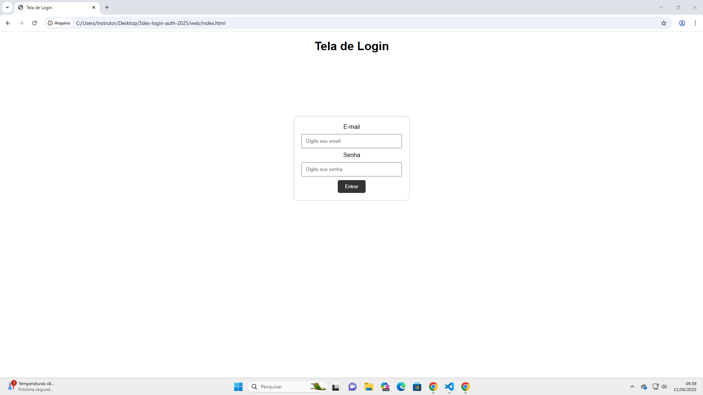
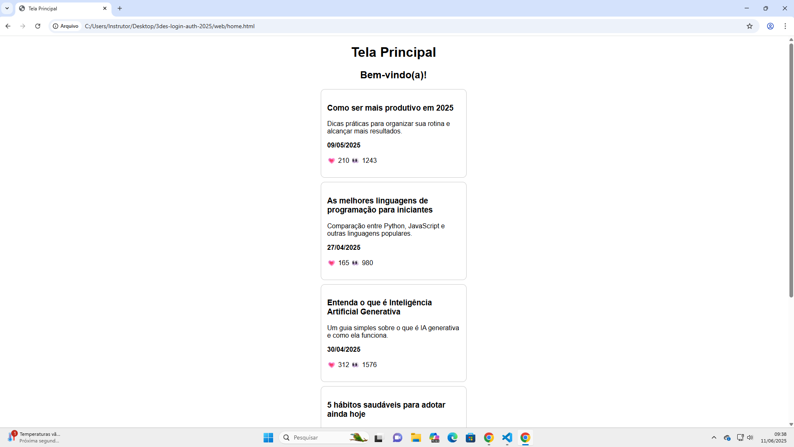

# Projeto Tela Principal com Posts

Este projeto é uma aplicação simples que contém uma tela de login e uma tela principal que exibe posts. A aplicação possui um backend em Node.js com rotas protegidas por autenticação JWT, e um frontend em HTML, CSS e JavaScript.

---

## Funcionalidades

- Tela de login com autenticação via token JWT.
- Tela principal que exibe uma lista de posts.
- Posts podem ser exibidos via API ou diretamente no frontend 

---

## Tecnologias usadas

- **Backend:** Node.js, Express, CORS, JWT (para autenticação)
- **Frontend:** HTML, e JavaScript (fetch API)
  
---

## Estrutura do projeto
/api
/src
/controllers
posts.js
/data
posts.js
/middlewares
auth.js
/routes
login.js
posts.js
server.js

/web
home.html
index.html
 
## 🔐 Tela de Login

Página onde o usuário informa seu e-mail e senha para acessar os posts.

---

## 🏠 Tela Principal (Home)

Após o login, o usuário visualiza a listagem dos posts.

